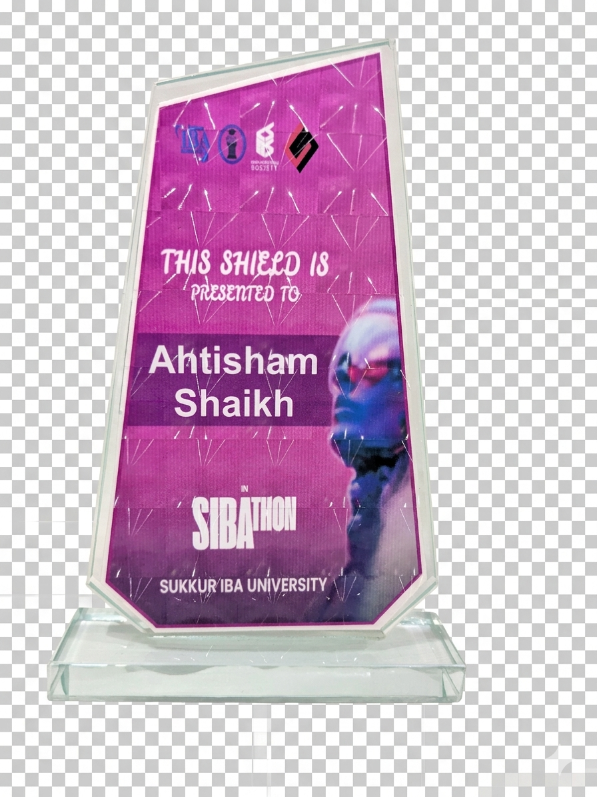

<p align="center">
    <a href="https://github.com/Ahtisham-1214">
    
    </a>
</p>
<!--- Adding Header Elements -->
<p align="center">
    <a href="https://linkedin.com/in/ahtishamshaikh1214">
        
    </a>&nbsp;&nbsp;&nbsp;&nbsp;
    <a href="https://stackoverflow.com/users/26632888">
        
    </a>&nbsp;&nbsp;&nbsp;&nbsp;
    <a href="https://facebook.com/ahtisham.shaikh.1214">
        
    </a>&nbsp;&nbsp;&nbsp;&nbsp;
    <a href="https://instagram.com/ahtishamshaikh1214">
        
    </a>&nbsp;&nbsp;
    <a href="https://mail.google.com/mail/?view=cm&to=ahtishamshaikh1214@gmail.com">
        
    </a>&nbsp;&nbsp;
    <a href="https://x.com/Ahtisham1214">
        

</p>


<br>

<!-- [](https://github.com/Ahtisham-1214/github-profile-trophy) -->


**💻Tech Stack:**<br><br>
<p>
<b>Languages:</b>&nbsp;&nbsp;&nbsp;
    &nbsp;&nbsp;
    &nbsp;&nbsp;
    &nbsp;&nbsp;
    &nbsp;&nbsp;
    &nbsp;&nbsp;
    &nbsp;&nbsp;
    &nbsp;&nbsp;
    &nbsp;&nbsp;
    <br><br><br>
<b>Libraries & Frameworks:</b>&nbsp;&nbsp;&nbsp;
    &nbsp;&nbsp;
    &nbsp;&nbsp;
    &nbsp;&nbsp;
    &nbsp;&nbsp;
    &nbsp;&nbsp;
    &nbsp;&nbsp;
    &nbsp;&nbsp;
    &nbsp;&nbsp;
    &nbsp;&nbsp;
    <br><br><br>
    <b>Tools & Platforms:</b>&nbsp;&nbsp;&nbsp;
    &nbsp;&nbsp;
    &nbsp;&nbsp;
    &nbsp;&nbsp;
    &nbsp;&nbsp;
    &nbsp;&nbsp;
    &nbsp;&nbsp;
    &nbsp;&nbsp;
    &nbsp;&nbsp;
    &nbsp;&nbsp;
    &nbsp;&nbsp;
    &nbsp;&nbsp;
    &nbsp;&nbsp;
    &nbsp;&nbsp;
    &nbsp;&nbsp;
    &nbsp;&nbsp;
    &nbsp;&nbsp;
    &nbsp;&nbsp;
    &nbsp;&nbsp;
    <br><br><br>
    &nbsp;&nbsp;&nbsp;<b>Databases :</b>&nbsp;&nbsp;&nbsp;
</p><br><br>

<h2 style="color:#e8df7a; display: flex; align-items: center;">
    <a href="https://leetcode.com/u/Ahtisham1214/" style="display: inline-flex; align-items: center; text-decoration: none;">
        </a>
        <span style="color:#e8df7a; font-size: 1.5em; vertical-align: middle;">LeetCode Stats:</span>
</h2>

<p>
    <a href="https://leetcode.com/u/Ahtisham1214/">
    
    </a>
    <br>
    <a href="assets/50daysproof.png">
    </a>
</p>

<h2 style="color:#e8df7a; display: flex; align-items: center;">
    <a href="https://github.com/Ahtisham-1214" style="display: inline-flex; align-items: center; text-decoration: none;">
        </a>
        <span style="color:#e8df7a; font-size: 1.5em; vertical-align: middle;">GitHub Stats:</span>

    
</h2>
<p>
    <br>
    <br>
    <br>
    
    
    <p align="center"></p>
    <br>
    
</p>

<h3 style="color:#e8df7a;">✍️ Random Dev Quote</h3>


<hr>


<details open> 
  <summary><h2>📕 Projects I've Contributed To</h2></summary>
   <p align="left">
    <a href="https://github.com/asmahussain48/Ecommerce-Large-GUI-Based_-working-on-it-">
  
</a>
<a href="https://github.com/Haziq8900/Bank-Management-System">
  
</a>
  </p>

  <p align="left">
    <a href="https://github.com/Ahtisham-1214?tab=repositories&type=fork"></a>
  </p>
</details> 

<details open> 
  <summary><h2>📌 Pinned</h2></summary>
    <a href="https://github.com/Ahtisham-1214/Expense-Tracker-Flutter.git">
 
</a>
<a href="https://github.com/Ahtisham-1214/Encryption-And-Description-using-Flask.git">
 
</a>
<a href="https://github.com/Ahtisham-1214/TailorManagementWeb.git">
 
</a>    
</details> 
<hr>
<details open> 
  <summary><h2>★ Certificates & Acheivements</h2></summary>
    
    <a href="assets/google-ai-essentials.png">
 
</a><br>
<a href="assets/internship.png">
 
</a>
<a href="assets/githubworkshop.jpg">
 
</a>
<a href="assets/Linkedinworkshop.png">
 
</a>
<a href="assets/pandasworkshop.png">
 
</a><br>  
<a href="assets/mlsapython.jpg">
 
</a>
<a href="assets/mlsaAI.jpg">
 
</a>
<a href="assets/mlsaML.jpg">
 
</a>
<a href="assets/sibafest.jpg">
 
</a>   
</details> 

<div align="center">

```diff
+@ @ @ @ @ @ @ @ @ @ @ @ @ @ @ @ @ @ @ @ @ @ @ @ @ @ @ @+
@@       o o                                           @@
@@       | |                                           @@
@@      _L_L_                                          @@
@@   ❮\/__-__\/❯  A habit missed once is a mistake,    @@
@@   ❮(|~o.o~|)❯    A habit missed twice is a start    @@
@@   ❮/ \`-'/ \❯          of new habit!                @@
@@     _/`U'\_                                         @@
@@    ( .   . )     .----------------------------.     @@
@@   / /     \ \    | while( ! (succed=try() ) ) |     @@
@@   \ |  ,  | /    '----------------------------'     @@
@@    \|=====|/                                        @@
@@     |_.^._|                                         @@
@@     | |"| |                                         @@
@@     ( ) ( )   Testing leads to failure              @@
@@     |_| |_|   and failure leads to understanding    @@
@@ _.-' _j L_ '-._                                     @@
@@(___.'     '.___)                                    @@
+@ @ @ @ @ @ @ @ @ @ @ @ @ @ @ @ @ @ @ @ @ @ @ @ @ @ @ @+
```
  
</div>


[](https://user-badge.committers.top/pakistan_public/Ahtisham-1214)<br>
[](https://user-badge.committers.top/pakistan/Ahtisham-1214)<br>
[](https://user-badge.committers.top/pakistan_private/Ahtisham-1214)
<br>
&nbsp;&nbsp;&nbsp;&nbsp;&nbsp;&nbsp;&nbsp;&nbsp;&nbsp;&nbsp;&nbsp;&nbsp;&nbsp;&nbsp;&nbsp;&nbsp;&nbsp;&nbsp;&nbsp;&nbsp;&nbsp;&nbsp;&nbsp;&nbsp;&nbsp;&nbsp;&nbsp;&nbsp;&nbsp;&nbsp;&nbsp;&nbsp;&nbsp;&nbsp;&nbsp;&nbsp;&nbsp;&nbsp;&nbsp;&nbsp;&nbsp;&nbsp;&nbsp;&nbsp;&nbsp;&nbsp;&nbsp;&nbsp;&nbsp;&nbsp;&nbsp;&nbsp;&nbsp;&nbsp;&nbsp;&nbsp;&nbsp;&nbsp;&nbsp;&nbsp;&nbsp;&nbsp;&nbsp;&nbsp;&nbsp;&nbsp;&nbsp;&nbsp;&nbsp;&nbsp;&nbsp;&nbsp;&nbsp;&nbsp;&nbsp;&nbsp;&nbsp;&nbsp;&nbsp;&nbsp;&nbsp;&nbsp;&nbsp;&nbsp;&nbsp;&nbsp;&nbsp;&nbsp;&nbsp;&nbsp;&nbsp;&nbsp;&nbsp;&nbsp;&nbsp;&nbsp;&nbsp;&nbsp;&nbsp;&nbsp;&nbsp;&nbsp;&nbsp;&nbsp;&nbsp;&nbsp;&nbsp;&nbsp;&nbsp;&nbsp;&nbsp;&nbsp;

